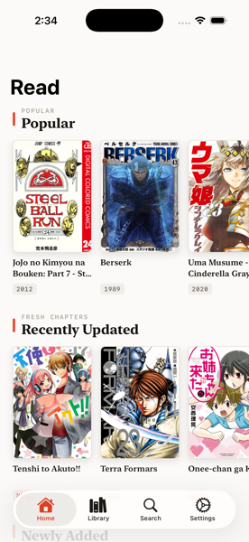
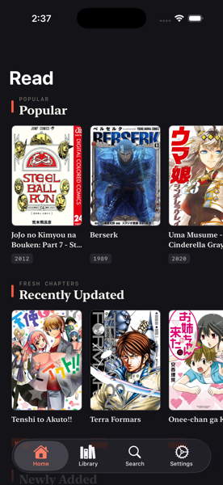

# MangaCarta

A native iOS manga reader built with SwiftUI, powered by the [MangaDex](https://mangadex.org) API. No third-party dependencies — pure SwiftUI and Foundation.

<p align="center">
  
  
</p>

## Features

- **Multi-source** — browse and read across more than one source (MangaDex plus a Cloudflare-protected, HTML-scraped site) through a common source abstraction. A title carried by several sources is one entry with a chosen source behind it: the app ranks them, and you can set a primary source or pin one title to one source
- **Browse** popular titles, recently updated chapters, and newly added manga, with a personalized **"For You"** recommendation rail built on-device from your reading history
- **Search** — debounced, source-scoped title search with infinite scroll
- **Read** chapters in three modes — left-to-right, right-to-left (manga order), and webtoon-style continuous vertical scroll — with pinch-to-zoom and double-tap-to-zoom on paged pages
- **Library** — save manga on-device, see "NEW" badges for unread chapters, and revisit saved titles later; the library refreshes in the background and can notify you when a saved title gets a new chapter
- **History** — a full chronological reading log; reopen any entry at the exact page you left off, with Netflix-style advance to the next chapter
- **MyAnimeList** — optional sign-in for a canonical metadata layer, a "More Like This" rail resolved across your registered sources, and reading progress pushed to your MAL list as you finish chapters
- **Light / dark mode**, with a system, light, or dark override in Settings
- **"Ink & Seal"** design language — a print-inspired visual identity: warm paper / near-black ink surfaces, a single vermilion seal accent, serif display type, and monospaced metadata stamps

## Architecture

MVVM over a source-abstraction layer:

```
MangaSource (protocol)  →  @MainActor ObservableObject view models  →  SwiftUI views
```

Nothing outside the source adapters calls a provider API directly. The file-by-file breakdown,
the conventions that hold it together, and the reasons behind them live in
[`CLAUDE.md`](CLAUDE.md) and [`docs/adr/`](docs/adr/) — this README deliberately does not
restate them.

## Requirements

- Xcode 16+
- iOS 17.5+ (some UI paths use `#available(iOS 18.0, *)`)

## Getting started

Open `MangaCarta.xcodeproj` in Xcode and run the `MangaCarta` scheme (⌘R).

Or build from the command line:

```sh
xcodebuild -scheme MangaCarta -destination 'platform=iOS Simulator,name=iPhone 17 Pro' build
```

Run the test suite:

```sh
xcodebuild -scheme MangaCarta -destination 'platform=iOS Simulator,name=iPhone 17 Pro' test
```

## Project status

The core reading loop is complete. `CLAUDE.md` owns the current-state breakdown and the build
conventions — it is the one place kept true, so prefer it over any summary here.

## Roadmap

Current direction: a hot-loadable, third-party extension system (Paperback/Aidoku-style), so
sources can ship without shipping the app. What is outstanding at any moment lives in the single
live file under [`docs/superpowers/handoff/`](docs/superpowers/handoff/); shipped state lives in
[`CLAUDE.md`](CLAUDE.md), and the decisions behind it in [`docs/adr/`](docs/adr/).

## Acknowledgments

Manga metadata and cover art courtesy of the [MangaDex API](https://api.mangadex.org/docs/). This project is not affiliated with or endorsed by MangaDex.
